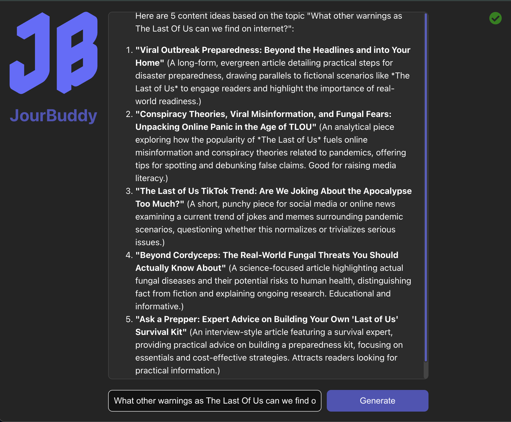

# JourBuddy Project

This project is composed of a backend and frontend developed using TypeScript, Express, and React. The backend integrates with Google Gemini (GenAI) API for content suggestions, and the frontend allows users to interact with the backend to generate content ideas based on a prompt.



## Project Structure
#### Backend:
-	The backend uses Express and TypeScript to provide an API endpoint for generating content suggestions.
-	Google Gemini (GenAI) API is used to generate content ideas based on the user-provided prompt.
-	The project is containerized with Docker for easy deployment.
#### Frontend:
-	The frontend is built with React and TypeScript using Vite as the build tool.
-	It communicates with the backend to send prompts and receive content suggestions.

## Directory Structure

```
content-suggestions/
├── backend/
│   ├── src/                    
│   ├── dist/ (generated after build)
│   ├── .env                    
│   ├── package.json            
│   ├── tsconfig.json           
│   └── Dockerfile              
├── frontend/
│   ├── src/  
│   ├── dist/  (generated after build)                 
│   ├── .env    
│   ├── package.json            
│   ├── tsconfig.json           
│   └── Dockerfile              
├── docker-compose.yml          
├── README.md                   
└── .gitignore                  
```

## Prerequisites

Make sure you have the following installed on your local machine:
-	Docker and Docker Compose
-	Node.js (for local development if not using Docker)

## Installation
#### Step 1: Clone the Repository

Clone the repository to your local machine:

```bash
git clone https://github.com/your-username/project-name.git content-suggestions
cd content-suggestions
```
---

#### Step 2: Set Up Environment Variables

These files will hold the environment variables on each project.
In the backend directory, create a .env file and add your Google Gemini API key:

`GEMINI_API_KEY=your_google_gemini_api_key_here`

In the frontend directory, you also must create an .env file and add the backend URL.

`VITE_BACKEND_URL=http://localhost:4000`

---

#### Step 3: Install Dependencies

##### Backend
1.	Navigate to the backend folder:

`cd backend`


2.	Install backend dependencies:

`npm install`


##### Frontend
1.	Navigate to the frontend folder:

`cd ../frontend`


2.	Install frontend dependencies:

`npm install`


---

#### Step 4: Docker Setup

To run the project with Docker and Docker Compose, follow these steps:
	1.	Ensure you’re in the root of the project, where the docker-compose.yml file is located.
	2.	Build and start the services using Docker Compose:

`docker-compose up --build`


This command will build the Docker images and start both the frontend and backend services.

---

#### Step 5: Local Development (Optional)

If you want to run the project locally without Docker, follow these steps:

##### Backend:
1.	Navigate to the backend folder:

`cd backend`


2.	Start the backend in development mode using ts-node:

`npm run dev`


This will start the backend server on `http://localhost:4000.`

##### Frontend:
1.	Navigate to the frontend folder:

`cd ../frontend`


2.	Start the frontend development server using Vite:

`npm run dev`


This will start the frontend server on `http://localhost:5173.`

---

#### Step 6: Test the API

After starting the servers, you can test the backend API using Postman or Insomnia.
1.	Send a POST request to http://localhost:4000/suggestions with the following JSON body:

```json
{
  "prompt": "cloning extinct animals"
}
```


2.	The response should be a list of content suggestions generated by the Google Gemini API. 
```json
{
	"suggestions": "Okay, here are some content ideas for the topic of \"cloning extinct animals,\" varying in style and purpose:\n\n*   **\"De-extinction Dilemma: The Ethics of Cloning Long-Gone Species\"** (A long-form article exploring the ethical considerations, covering arguments for and against, potential ecological impacts, and societal responsibilities.)\n*   **\"Jurassic Park...In Real Life? Scientists Closer Than Ever to Cloning Extinct Animals\"** (A news piece summarizing recent breakthroughs and milestones in the field, highlighting specific animals and timelines.)\n*   **\"Top 5 Animals We Could (Potentially) Clone and Why\"** (A visually engaging social media post – think a short video or carousel – outlining the animals with the best chances of resurrection and their importance.)\n*   **\"Beyond the Mammoth: How De-extinction Technology Could Revolutionize Conservation Efforts\"** (An evergreen article focusing on the positive impacts of cloning technology on modern endangered species, reframing the discussion beyond just bringing back the dead.)\n*   **\"Cloning Extinct Animals: A Glossary of Terms You Need to Know\"** (A helpful guide breaking down the science behind cloning in simple terms, ideal for newcomers to the topic and improving search engine optimization.)\n"
}
```

---

#### Step 7: Build for Production

If you want to build the project for production:

##### Backend:
1.	Build the backend TypeScript code:

`npm run build`


2.	Start the backend in production mode:

`npm run start:prod`


##### Frontend:
1.	Build the frontend:

`npm run build`


This will generate the production-ready files for the frontend in the dist folder.

---

## Docker Compose Overview
-	backend: The backend service is built using the Dockerfile in the backend folder. It exposes port `4000` and connects to the app-network.
-	frontend: The frontend service is built using the Dockerfile in the frontend folder. It exposes port `5173` and depends on the backend service.

##### Notes
-	Make sure to replace your_google_gemini_api_key_here with your actual API key in the .env file for the backend to authenticate with the Google Gemini API.

##### Funny Prompt Examples

- Healthy eating and mental exercise at work.

- Stand-up comedians are the most logical.

- Uncut Gems is a must watch movie.

- What other warnings as The Last Of Us can we find on internet?
## Pending Features

These are the features that are still to be implemented:

- **Button to clear everything**: Add a button that will clear all the data and inputs in the application.
- **Enable Enter key to submit the prompt**: Add functionality to allow the user to submit the prompt by pressing the **Enter/Return** key.
- **Linter and code formatting**: Set up and configure a linter and automatic code formatting tools to maintain code quality.
- **Modularize components**: Refactor the components to make them more modular and reusable.
- **Add a history section**: Create a right panel in order to keep a suggestions history list. 

## License

MIT License

Copyright (c) 2025 [Tato](https://tato-portfolio.vercel.app/)

Permission is hereby granted, free of charge, to any person obtaining a copy
of this software and associated documentation files (the "Software"), to deal
in the Software without restriction, including without limitation the rights
to use, copy, modify, merge, publish, distribute, sublicense, and/or sell
copies of the Software, and to permit persons to whom the Software is
furnished to do so, subject to the following conditions:

The above copyright notice and this permission notice shall be included in all
copies or substantial portions of the Software.

THE SOFTWARE IS PROVIDED "AS IS", WITHOUT WARRANTY OF ANY KIND, EXPRESS OR
IMPLIED, INCLUDING BUT NOT LIMITED TO THE WARRANTIES OF MERCHANTABILITY,
FITNESS FOR A PARTICULAR PURPOSE AND NONINFRINGEMENT. IN NO EVENT SHALL THE
AUTHORS OR COPYRIGHT HOLDERS BE LIABLE FOR ANY CLAIM, DAMAGES OR OTHER
LIABILITY, WHETHER IN AN ACTION OF CONTRACT, TORT OR OTHERWISE, ARISING FROM,
OUT OF OR IN CONNECTION WITH THE SOFTWARE OR THE USE OR OTHER DEALINGS IN THE
SOFTWARE.